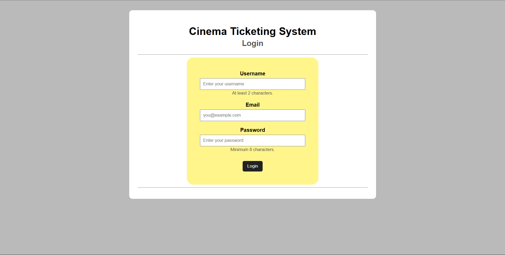
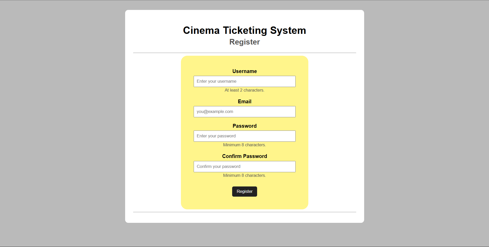
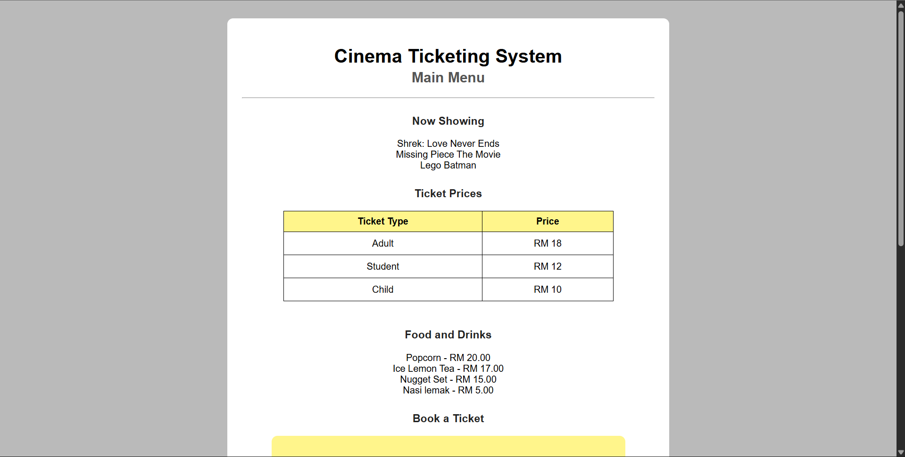
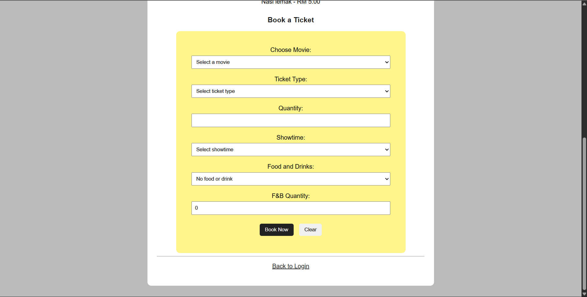
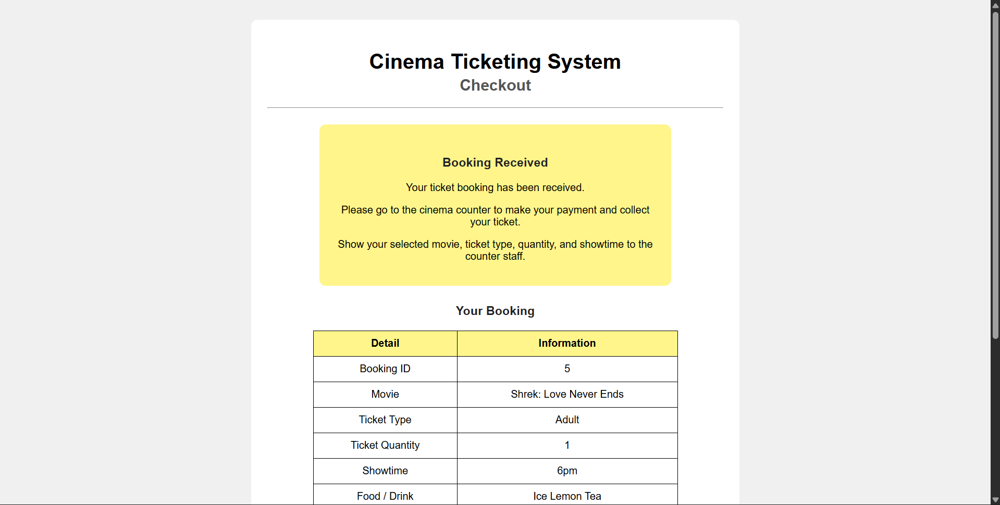
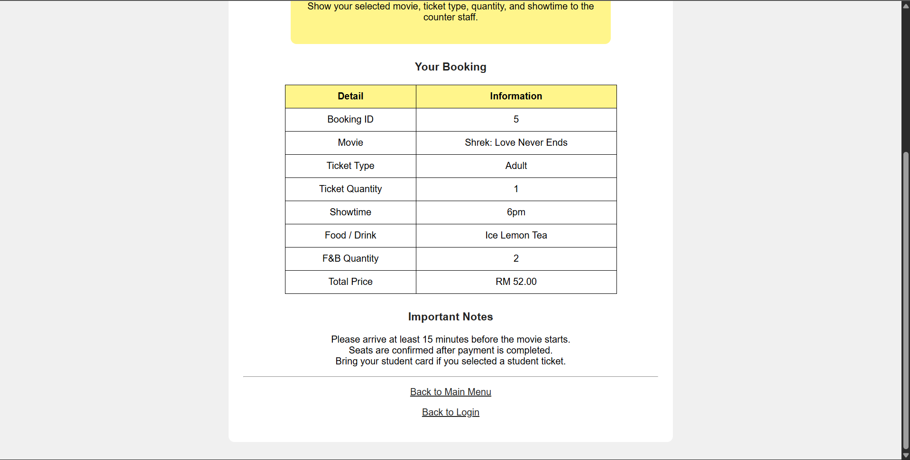
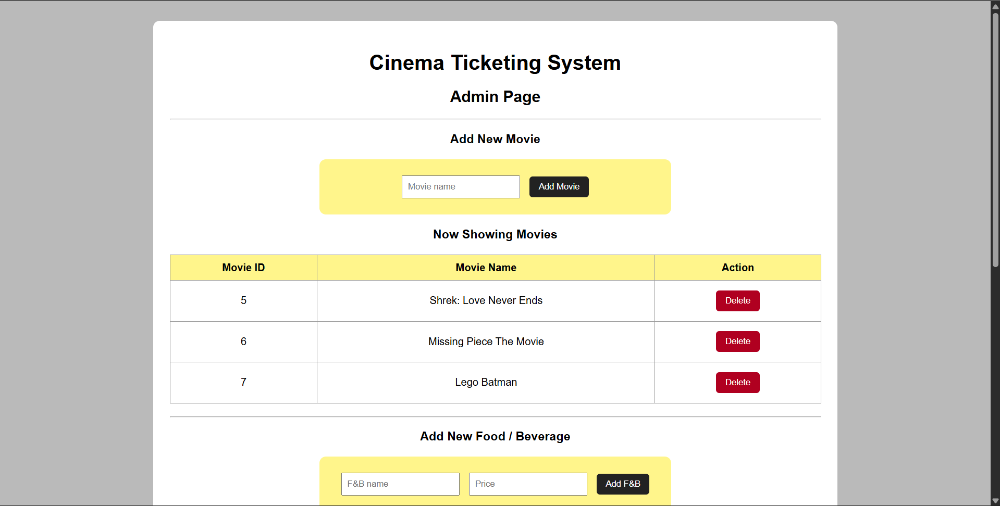
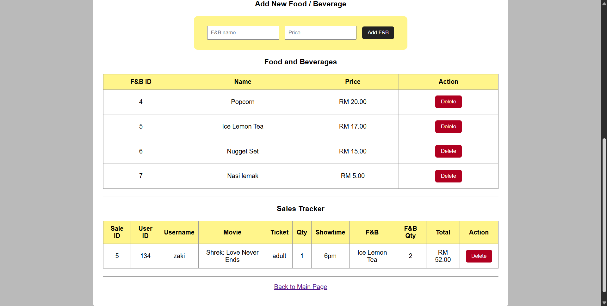

# Cinema Ticketing System
A simple website designed to help users book movie tickets and order food and beverages online, eliminating the need to wait in line at the counter.

## Table of contents

- [Screenshots](#screenshots)
- [Features](#features)
- [Tech stack](#tech-stack)
- [Requirements](#requirements)
- [Admin Access](#admin-access)

## Screenshots

Login Page

Registration Page

Main Page

Checkout Page

Admin Page

## Features

- Browse movies and showtimes
- Select seats and purchase tickets
- Order food & beverages with ticket booking
- Booking history for users
- Admin interface for managing movies, showtimes, and orders (if implemented)
- Basic validation and user-friendly flow

## Tech stack

- Language: PHP
- Web server: Apache or Nginx
- Database: MySQL / MariaDB (or another relational DB)

Note: This repository is 100% PHP, as indicated by the language composition. If you use a framework (Laravel, Symfony, etc.), adjust the instructions below to your framework's conventions.

## Requirements

- PHP 7.4+ (8.0+ recommended)
- MySQL or MariaDB
- A web server (Apache / Nginx) or the PHP built-in server for local testing

## Admin Access

This website includes an admin page to view and update the database. To access the page, enter the credentials below:
- Username: admin
- Email: admin@cinema.com
- Password: admin12345
